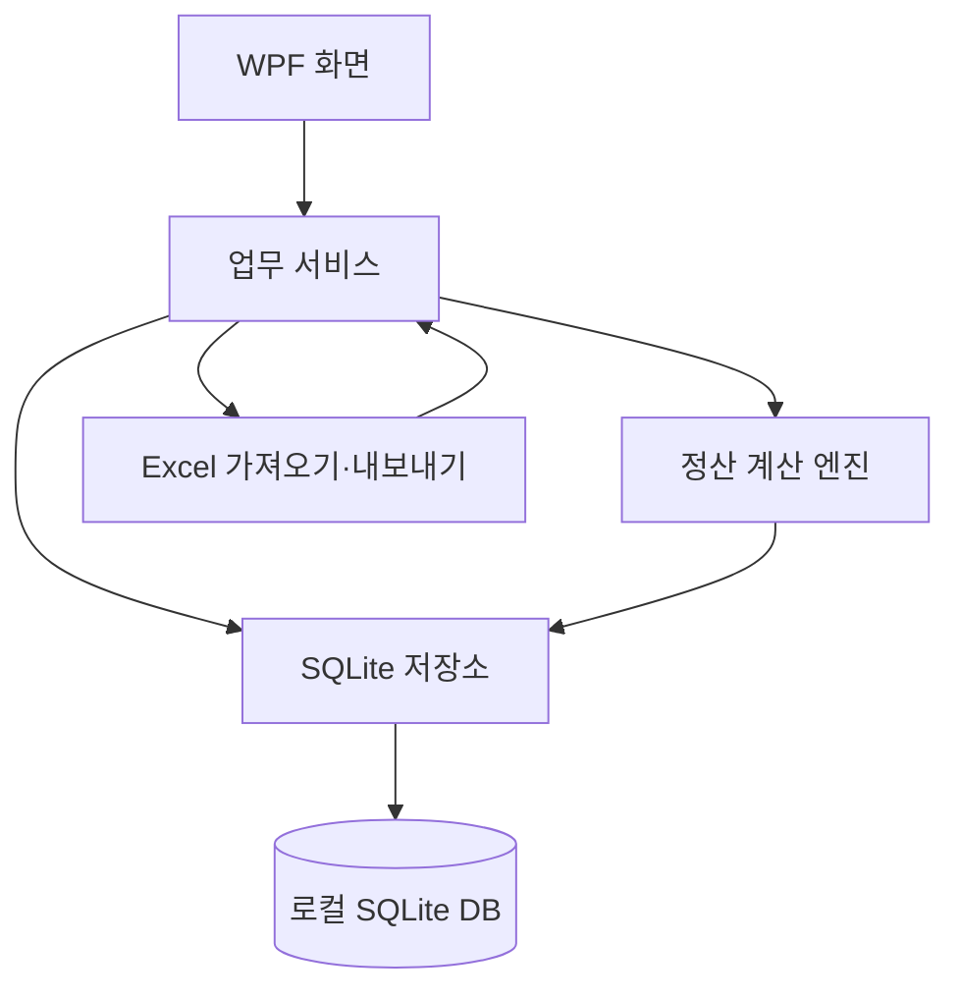
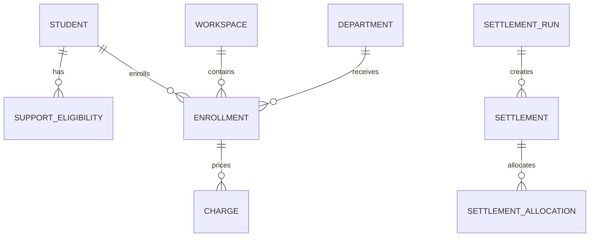

# 방과후 수강·지원금 통합 관리 프로그램 설계안

## 1. 결론과 핵심 결정

앱은 `.NET 8 WPF` 단일 Windows 프로세스와 로컬 `SQLite` DB로 구성한다. 수강 원본과 정산 스냅샷을 분리하고, 정산은 사용자가 명시적으로 생성할 때만 실행한다. 모든 금액은 실수형이 아니라 **원 단위 정수(INTEGER)** 로 저장한다.

가장 중요한 구조적 결정은 다음과 같다.

1. `Student`, `Department`, `Enrollment`, `Charge`가 원본(Source of Truth)이다.
2. 지원 대상은 학생 테이블의 문자열 열이 아니라 `SupportEligibility` 관계로 관리한다. 화면의 “지원유형”은 관계를 조합한 표시값이다.
3. 지원 제도는 `SupportProgram`으로 일반화한다. `VOUCHER`, `FREE_VOUCHER`는 데이터 코드이며 특정 학년 명칭은 출력 템플릿에서만 사용한다.
4. 정산 결과는 `SettlementRun`, `Settlement`, `SettlementAllocation`에 스냅샷으로 저장한다.
5. 각 작업공간의 `source_revision`과 정산 의존 작업공간 revision을 비교해 정산 결과가 최신인지 판정한다.
6. 품의는 저장된 배분 결과를 `부서 × 비용항목 × 재원`으로 집계하며 계산 엔진과 Excel 출력기를 분리한다.

## 2. 전체 아키텍처

- UI: 화면 표시, 입력 검증 메시지, 검색·필터·정렬
- 업무 서비스: 학생 연결, 중복 검사, 변경 이력, revision 증가, 트랜잭션
- 저장소: 매개변수 SQL, FK/UNIQUE/CHECK 제약, 인덱스
- 정산 엔진: UI 및 Excel 출력과 독립된 순수 계산 모듈
- Excel 계층: 행 파싱 → 검증 결과 → 정상 행만 트랜잭션 반영
- 설정: DB 경로, 최근 작업공간, 백업 경로 등은 JSON으로 저장

프로그램 파일과 업무 데이터는 분리한다.

- 프로그램: 설치 경로
- 기본 DB: `%LOCALAPPDATA%\AfterSchoolIntegratedManager\data\afterschool.db`
- 설정: `%LOCALAPPDATA%\AfterSchoolIntegratedManager\settings.json`
- 백업: 사용자가 선택한 폴더에 단일 백업 묶음

## 3. 화면 및 메뉴 구조

상단 고정 영역에는 `학년도 / 작업공간명 / 시작일 / 종료일 / 원본 변경 여부`를 항상 표시한다.

| 대메뉴 | 화면 | 핵심 기능 |
|---|---|---|
| 대시보드 | 현황 | 전체 학생, 수강생, 부서, 지원 대상, 최근 정산 일시 |
| 작업공간 | 작업공간 관리 | 생성, 선택, 수정, 시작일 정렬 |
| 기초 데이터 | 학생정보 | 전교생 CRUD, Excel, 전체/선택 삭제 |
| 기초 데이터 | 지원대상자 | 이용권/자유수강권 자격 연결, Excel |
| 기초 데이터 | 부서정보 | 부서·반·요일·강사·기본 비용 CRUD, Excel |
| 수강 관리 | 수강생 명단 | 수강 원본이 있는 학생만 표시, 추가·검색·필터 |
| 정산 | 정산 생성 | 최신상태 검사, 명시적 생성, 생성 이력 |
| 정산 | 수익자/이용권/자유수강권 | 저장된 정산 결과 조회 |
| 품의 | 품의 양식 받기 | 비용항목 선택, 부서별 집계, Excel |
| 설정 | 정책/데이터/백업 | 지원금·우선순위·대상학년·경로·백업 |

MVP 1 화면은 작업공간, 학생정보, 지원대상자, 부서정보, 수강생 명단을 우선 제공한다.

## 4. 사용자 업무 흐름

1. 학년도와 기간을 지정해 작업공간을 만든다.
2. 전교생 명단을 입력하거나 Excel로 가져온다.
3. 이용권 및 자유수강권 대상자를 학생과 연결한다.
4. 부서와 항목별 기본 수강료를 등록한다.
5. 수강 데이터를 입력한다. 이때 학생과 부서가 검증되고 기본 비용이 수강별 `Charge`로 복사된다.
6. 중도 변경이 생기면 원본 금액을 유지한 채 실제 적용금액과 사유를 기록한다.
7. 정산이 필요할 때 정산 생성 버튼을 누른다.
8. 저장된 재원 배분 결과를 학생별·재원별로 확인한다.
9. 품의 종류를 선택해 부서별 금액을 집계하고 Excel로 저장한다.

## 5. 데이터 모델과 관계

### 핵심 테이블

| 테이블 | 목적 | 주요 제약 |
|---|---|---|
| `academic_year` | 학년도 정책 경계 | year UNIQUE |
| `workspace` | 월/분기/기수 작업 단위 | 종료일 ≥ 시작일 |
| `student` | 전교생 마스터 | 학년도+학년+반+번호 UNIQUE |
| `support_program` | 지원 제도 정의 | code UNIQUE, VOUCHER/FREE_VOUCHER |
| `support_eligibility` | 학생별 지원 자격과 기간 | 학생+제도+시작일 UNIQUE |
| `support_budget` | 학생별 또는 기본 지원 한도 | 학년도+학생+제도 UNIQUE |
| `support_policy` | 대상학년, 재원·항목 우선순위 | JSON이 아닌 정규화된 하위 테이블 사용 |
| `department` | 부서/반/요일/강사 | 학년도+부서명+반명 UNIQUE |
| `department_fee` | 부서 기본 항목별 금액 | 부서+비용항목 UNIQUE |
| `enrollment` | 작업공간별 수강 원본 | 활성 중 동일 작업공간+학생+부서 중복 방지 |
| `charge` | 수강별 기본/실제 비용 | 금액 ≥ 0, 항목별 1행 |
| `change_history` | 중요 변경 이력 | 이전/변경값과 사유 저장 |
| `settlement_run` | 정산 실행 메타데이터 | 작업공간별 활성 실행 1개 |
| `settlement` | 실행별 학생 합계 | 실행+학생 UNIQUE |
| `settlement_allocation` | 개별 Charge의 재원별 배분 | 금액 > 0 |
| `settlement_dependency` | 정산 당시 선행 작업공간 revision | 실행+작업공간 UNIQUE |

실제 DDL은 `src/AfterSchoolManager/Data/schema.sql`에 있다.

### 지원유형 표시값

화면 표시값은 학생의 활성 자격을 조합한다.

| 활성 자격 | 화면 표시 |
|---|---|
| 없음 | 일반 |
| VOUCHER | 방과후 이용권 |
| FREE_VOUCHER | 자유수강권 |
| 둘 다 | 방과후 이용권 + 자유수강권 |

표시 문자열은 저장하지 않으므로 자격 변경 시 불일치가 생기지 않는다.

## 6. 정산 계산 로직

### 사전 조건

1. 현재 작업공간보다 시작일이 빠른 같은 학년도 작업공간의 활성 정산이 모두 존재하고 최신이어야 한다.
2. 현재 원본에 학생·부서·금액 오류가 없어야 한다.
3. 지원 정책, 학생별 한도, 재원 우선순위가 확정돼 있어야 한다.

선행 정산이 없거나 오래되었으면 현재 정산 생성을 막고 가장 먼저 다시 생성할 작업공간을 안내한다. 이를 통해 누적 금액이 과거 변경을 놓치지 않는다.

### 계산 순서

학생별로 다음을 수행한다.

1. 현재 작업공간의 활성 수강에서 `charge.actual_amount`를 읽는다.
2. 비용항목 우선순위(기본: 강사료 → 수용비 → 교재비 → 재료비 → 기타), 수강 배분순서, charge id 순으로 정렬한다.
3. 각 지원 제도의 연간 한도에서 선행 작업공간 확정 사용액을 빼 가용잔액을 구한다.
4. 학생에게 활성화된 재원을 정책의 재원 우선순위대로 적용한다.
5. 각 Charge마다 `min(남은 Charge, 해당 재원 잔액)`을 배분한다.
6. 모든 지원 재원 적용 후 남은 금액은 학생에게 이용권 자격이 있으면 `VOUCHER_OVER`, 없으면 `SELF_PAY`로 배분한다.
7. Charge별 배분액 합계가 실제 적용금액과 정확히 같은지 검증한다.
8. 전체 결과를 하나의 DB 트랜잭션으로 저장하고 활성 정산 실행을 교체한다.

불변식:

`각 Charge 실제금액 = SELF_PAY + VOUCHER + VOUCHER_OVER + FREE_VOUCHER`

취소된 수강은 기본적으로 정산에서 제외한다. 환불·부분금액은 수강을 삭제하지 않고 Charge의 `actual_amount`를 조정하여 반영한다.

## 7. 이용권 + 자유수강권 중복 대상자

중복 자격 자체는 별도 유형으로 하드코딩하지 않는다. 학생에게 두 개의 활성 `SupportEligibility`가 연결된 상태다.

정책에는 재원 우선순위를 저장한다.

- 예시 A: VOUCHER → FREE_VOUCHER → 본인부담
- 예시 B: FREE_VOUCHER → VOUCHER → 본인부담

지원금으로 모두 처리하지 못한 잔여액의 표시 규칙은 다음과 같다.

- 이용권 자격 있음: `VOUCHER_OVER`
- 이용권 자격 없음: `SELF_PAY`

따라서 중복 대상자가 자유수강권까지 적용받은 뒤에도 금액이 남으면 2026 품의에서 “3학년 초과금”으로 집계된다. 정책 변경 시에는 재원 순서만 바꾸고 계산 코드는 바꾸지 않는다.

## 8. 작업공간 간 누적 계산과 최신상태

작업공간마다 `source_revision`을 둔다. 수강, Charge, 대상자, 부서비용 등 정산에 영향을 주는 변경이 성공적으로 커밋될 때 관련 작업공간 revision을 1 증가시킨다.

정산 실행 시 현재 및 모든 선행 작업공간의 `(workspace_id, source_revision)`을 `settlement_dependency`에 복사한다. 이후 다음 중 하나라도 다르면 정산은 오래된 상태다.

- 의존 작업공간 revision 변경
- 지원 정책 revision 변경
- 학생별 지원한도 revision 변경

이 구조는 8월 데이터 변경 때문에 4월 정산까지 불필요하게 오래된 것으로 표시되는 문제를 피하면서, 4월 변경이 5월 이후 누적 정산에 미치는 영향은 정확히 감지한다.

동일 시작일의 작업공간은 `settlement_order`로 선후를 확정한다. 순서 중복은 허용하지 않는다.

## 9. 품의 집계 로직

품의는 활성 정산 실행의 `SettlementAllocation`을 기준으로 한다.

1. 사용자가 비용항목 하나 또는 교재+재료 통합을 선택한다.
2. Allocation → Charge → Enrollment → Department를 연결한다.
3. `Department + ResourceCode`로 `SUM(amount)` 한다.
4. 출력 프로필이 내부 재원 코드를 학년도별 열 이름에 매핑한다.
5. 행 합계와 열 합계를 별도로 계산하고 서로 일치하는지 검증한다.

2026 출력 매핑:

| 내부 코드 | 출력 열 |
|---|---|
| SELF_PAY | 수익자(1,2,4,5,6학년) |
| VOUCHER_OVER | 3학년 초과금 |
| VOUCHER | 3학년 지원금 |
| FREE_VOUCHER | 자유수강권 |

인원수는 계산하거나 표시하지 않는다. 출력 프로필과 Excel 템플릿은 계산 서비스와 분리하여 학교별 양식을 나중에 교체할 수 있게 한다.

## 10. Excel 가져오기/내보내기

업로드 계층은 세 단계로 분리한다.

1. `Reader`: 헤더 별칭을 표준 필드로 매핑하고 원시 행을 읽음
2. `Validator`: 정상/경고/오류 행과 오류코드를 생성
3. `Importer`: 사용자가 확정한 정상 행만 트랜잭션으로 저장

업로드 결과 모델:

| 필드 | 설명 |
|---|---|
| row_number | Excel 원본 행 |
| status | VALID / WARNING / ERROR |
| error_code | STUDENT_NOT_FOUND 등 |
| message | 사용자가 수정할 설명 |
| normalized_data | 정규화된 값 |

정상 행과 오류 행을 함께 보여주며, 정상 행만 반영하거나 파일을 수정해 다시 검사할 수 있다. MVP 1에서는 핵심 헤더 검증·정상행 반영을 구현하고, 행별 미리보기 편집 UI는 후속 단계에서 강화한다.

내보내기는 조회 DTO를 Excel에 쓰며 DB 엔티티를 직접 노출하지 않는다. 모든 업로드 화면은 같은 헤더 정의를 사용하는 “업로드 양식 받기”를 제공한다.

## 11. 인덱스와 성능

- 학생: `(academic_year_id, grade, class_name, student_number)`, 이름
- 수강: `(workspace_id, status)`, student, department
- 자격: `(student_id, program_id, effective_from, effective_to)`
- Charge: enrollment, charge_type
- 정산 배분: settlement, charge, resource_code
- 작업공간: `(academic_year_id, start_date, settlement_order)`

목록 화면은 향후 서버형 페이징이 아니라 SQLite `LIMIT/OFFSET` 기반 가상화를 적용한다. 화면 렌더링 중 정산 계산은 절대 실행하지 않는다.

## 12. 백업·복원과 업데이트

- DB는 WAL 체크포인트 후 SQLite 온라인 백업 API로 복사한다.
- 설정 JSON과 DB, 첨부 출력 프로필을 ZIP 하나로 묶는다.
- 복원 전 현재 DB를 자동 안전백업하고 스키마 버전을 확인한다.
- 설치 파일은 앱 파일만 교체하며 `%LOCALAPPDATA%`의 업무 DB는 건드리지 않는다.
- GitHub Release 업데이트는 명시적 동의, 다운로드 진행률, 서명/해시 확인, 나중에 하기를 지원하는 별도 계층으로 둔다.
- 업데이트 확인 과정에도 학생정보나 DB 내용은 전송하지 않는다.

## 13. MVP별 구현 계획

### MVP 1 — 이번 구현

- WPF 프로젝트와 SQLite 초기화
- 작업공간 생성·선택
- 학생 CRUD 및 Excel
- 지원 대상자 연결 및 Excel
- 부서·기본비용 CRUD 및 Excel
- 수강 입력·목록 및 Excel
- 수강생 명단은 Enrollment가 있는 학생만 조회
- 제약조건, 핵심 인덱스, 원본 revision 기반 마련

### MVP 2

- 정책·학생별 지원한도 화면
- 정산 도메인 모델과 순수 계산 엔진 단위 테스트
- 선행 작업공간 유효성 검사
- 수익자/이용권/자유수강권 결과 탭
- 누적 사용·잔액·초과금

### MVP 3

- 수강 추가/취소/부분 환불
- Charge 기본금액/실제금액 편집
- 변경 사유 필수화 및 상세 이력
- 정산 의존 revision 비교와 재생성 안내
- 학생 상세 연간 타임라인

### MVP 4

- 항목별 부서 집계
- 2026 출력 프로필
- 강사료/수용비/교재비/재료비/통합 Excel
- 학교별 실제 품의 템플릿 어댑터

### MVP 5

- 백업/복원과 무결성 검사
- MSIX 또는 설치형 배포
- GitHub Release 업데이트 기반
- 대용량 목록 가상화·쿼리 튜닝
- Windows 실사용 시나리오 검증

## 14. 코딩 전 구조 검토 결과

요구사항과 충돌하거나 변경 비용이 큰 지점을 다음과 같이 해소했다.

- “지원유형”을 Student 단일 열로 저장하면 중복 자격과 기간 이력이 깨지므로 관계 테이블로 분리했다.
- 정산을 현재 작업공간 원본만으로 만들면 이전 달 수정이 누락되므로 선행 정산 최신상태를 필수 조건으로 했다.
- 한도 소진 시 어떤 부서가 지원/초과로 잡히는지 모호해질 수 있어 비용항목 우선순위와 수강 배분순서를 명시적으로 저장한다.
- 부서 기본금액이 나중에 바뀌어 과거 수강료가 변하는 문제를 막기 위해 등록 시점 금액을 Charge에 복사한다.
- 출력 열 이름을 DB 코드로 쓰지 않고 학년도별 출력 프로필에서만 변환한다.
- SQLite INTEGER 원 단위, FK, CHECK, UNIQUE와 트랜잭션으로 금액 및 관계 무결성을 보장한다.

이 구조라면 2027년 이후 대상 학년·지원 우선순위·학교별 품의 양식이 달라져도 핵심 DB와 정산 계산기를 다시 만들 필요가 없다.
